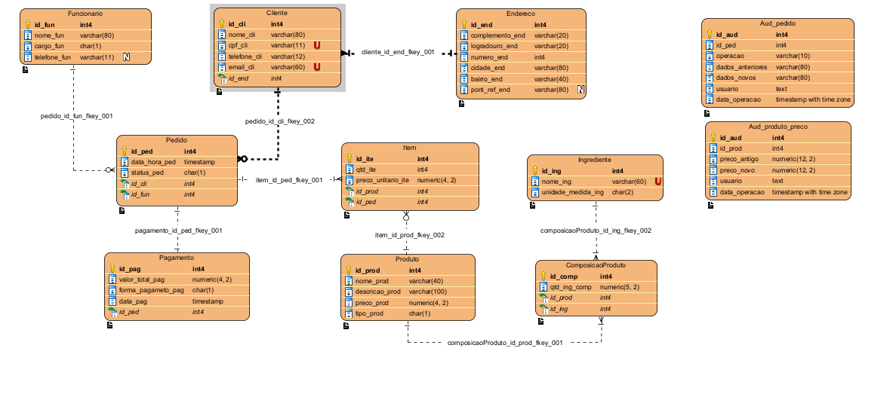
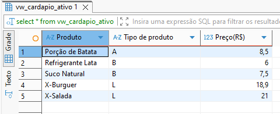
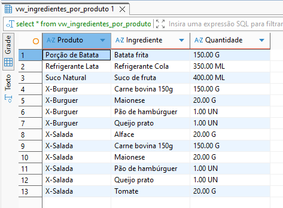
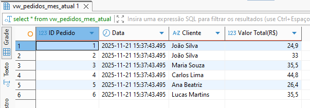
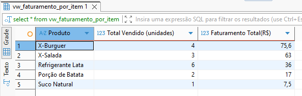

<h1 align="center">
  🍔 HEMN Hamburgueria 🍔
</h1>

> <h4>Criado por Nathan Ritter Wendling, Marco Antônio Schons Santos e Eduardo Augusto Romio Nofre</h4>

<hr>
<br>

<div name="mr-projeto" align="center">
  <h2>Modelo relacional do projeto</h2>
  
</div>

<br>

## Diagramas
Aqui, estarão todos os Diagramas requisitados pelo professor em formato ```.vpp```:

[Acessar Diagramas do projeto](./assets/Diagramas/)

<br>

## Dicionário de Dados - Hamburgueria HEMN

### Tabela Cliente

| Coluna         | Tipo          | Descrição                                              | Restrição / Observação                   |
|----------------|---------------|--------------------------------------------------------|-----------------------------------------|
| id_cli         | INT           | Identificador único do cliente                          | PK, auto-increment                      |
| id_end         | INT           | Identificador do endereço do cliente                    | FK → Endereco(id_end), obrigatório      |
| nome_cli       | VARCHAR(80)   | Nome completo do cliente                                | NOT NULL                               |
| cpf_cli        | VARCHAR(11)   | CPF do cliente                                         | NOT NULL, único                        |
| telefone_cli   | VARCHAR(12)   | Telefone do cliente                                    | NOT NULL                               |
| email_cli      | VARCHAR(60)   | E-mail do cliente                                      | Único, pode ser NULL                    |

Script de criação da tabela:
```
CREATE TABLE Cliente (
  id_cli       SERIAL NOT NULL, 
  nome_cli     varchar(80) NOT NULL, 
  cpf_cli      varchar(11) NOT NULL UNIQUE, 
  telefone_cli varchar(12) NOT NULL, 
  email_cli    varchar(60) NOT NULL UNIQUE, 
  id_end       int4 NOT NULL, 
  CONSTRAINT cliente_pkey 
    PRIMARY KEY (id_cli));
COMMENT ON TABLE Cliente IS 'Tabela Cliente.';
COMMENT ON COLUMN Cliente.id_cli IS 'Id do cliente';
COMMENT ON COLUMN Cliente.nome_cli IS 'Nome do cliente';
COMMENT ON COLUMN Cliente.cpf_cli IS 'CPF do cliente';
COMMENT ON COLUMN Cliente.telefone_cli IS 'Telefone do cliente';
```

### Tabela Endereco

| Coluna           | Tipo          | Descrição                                              | Restrição / Observação                   |
|------------------|---------------|--------------------------------------------------------|-----------------------------------------|
| id_end           | INT           | Identificador único do endereço                         | PK, auto-increment                      |
| complemento_end  | VARCHAR(20)   | Complemento do endereço                                 | NOT NULL                               |
| logradouro_end   | VARCHAR(20)   | Logradouro (rua, avenida, etc)                          | NOT NULL                               |
| numero_end       | INT           | Número do endereço                                     | NOT NULL                               |
| bairro_end       | VARCHAR(40)   | Bairro                                                | NOT NULL                               |
| cidade_end       | VARCHAR(80)   | Cidade                                                | NOT NULL                               |
| ponto_ref_end    | VARCHAR(80)   | Ponto de referência                                   | Pode ser NULL                          |

Script de criação da tabela:
```
CREATE TABLE Endereco (
  id_end          SERIAL NOT NULL, 
  complemento_end varchar(20) NOT NULL, 
  logradouro_end  varchar(20) NOT NULL, 
  numero_end      int4 NOT NULL, 
  cidade_end      varchar(80) NOT NULL, 
  bairro_end      varchar(40) NOT NULL, 
  pont_ref_end    varchar(80), 
  CONSTRAINT endereco_pkey 
    PRIMARY KEY (id_end));
COMMENT ON TABLE Endereco IS 'Tabela Endereco.';
COMMENT ON COLUMN Endereco.id_end IS 'Id do endereço';
COMMENT ON COLUMN Endereco.complemento_end IS 'Complemento do endereço';
COMMENT ON COLUMN Endereco.logradouro_end IS 'Logradouro do endereço';
COMMENT ON COLUMN Endereco.numero_end IS 'Número do endereço';
COMMENT ON COLUMN Endereco.cidade_end IS 'Cidade do endereço';
COMMENT ON COLUMN Endereco.bairro_end IS 'Bairro do endereço';
COMMENT ON COLUMN Endereco.pont_ref_end IS 'Ponto de referência do endereço';
```

### Tabela Funcionario

| Coluna          | Tipo          | Descrição                                              | Restrição / Observação                   |
|-----------------|---------------|--------------------------------------------------------|-----------------------------------------|
| id_fun          | INT           | Identificador único do funcionário                      | PK, auto-increment                      |
| nome_fun        | VARCHAR(80)   | Nome completo do funcionário                            | NOT NULL                               |
| cargo_fun       | CHAR(1)       | Cargos dos Funcionarios (''C'' - "Cozinheiro", ''A'' - "Atentende", ''E'' - "Entregador") | NOT NULL                        |
| telefone_fun    | VARCHAR(11)   | Telefone do funcionário                                | Pode ser NULL                          |

Script de criação da tabela:
```
CREATE TABLE Funcionario (
  id_fun       SERIAL NOT NULL, 
  nome_fun     varchar(80) NOT NULL, 
  cargo_fun    char(1) NOT NULL CHECK('C', 'A', 'E' ), 
  telefone_fun varchar(11), 
  CONSTRAINT funcionario_pkey 
    PRIMARY KEY (id_fun));
COMMENT ON TABLE Funcionario IS 'Tabela Funcionario.';
COMMENT ON COLUMN Funcionario.id_fun IS 'Id do funcionario';
COMMENT ON COLUMN Funcionario.nome_fun IS 'Nome do funcionario';
COMMENT ON COLUMN Funcionario.cargo_fun IS 'Cargos dos Funcionarios (''C'' - "Cozinheiro", ''A'' - "Atentende", ''E'' - "Entregador")';
COMMENT ON COLUMN Funcionario.telefone_fun IS 'Telefone do funcionario';
```

### Tabela Produto

| Coluna          | Tipo          | Descrição                                              | Restrição / Observação                   |
|-----------------|---------------|--------------------------------------------------------|-----------------------------------------|
| id_prod         | INT           | Identificador único do produto                          | PK, auto-increment                      |
| nome_prod       | VARCHAR(40)   | Nome do produto                                       | NOT NULL                               |
| descricao_prod  | VARCHAR(100)  | Descrição do produto                                  | NOT NULL                               |
| preco_prod      | NUMERIC(4,2)  | Preço do produto                                     | NOT NULL                               |
| tipo_prod       | CHAR(1)       | Tipo de produto (''L'' - "Lanche", ''A'' - "Acompanhamento", ''B'' - "Bebida") | NOT NULL                        |

Script de criação da tabela:
```
CREATE TABLE Produto (
  id_prod        SERIAL NOT NULL, 
  nome_prod      varchar(40) NOT NULL, 
  descricao_prod varchar(100) NOT NULL, 
  preco_prod     numeric(4, 2) NOT NULL, 
  tipo_prod      char(1) NOT NULL CHECK(tipo_prod in ('L' , 'B' , 'A' )), 
  CONSTRAINT produto_pkey 
    PRIMARY KEY (id_prod));
COMMENT ON TABLE Produto IS 'Tabela Produto.';
COMMENT ON COLUMN Produto.nome_prod IS 'Nome do produto';
COMMENT ON COLUMN Produto.descricao_prod IS 'Descrição do produto';
COMMENT ON COLUMN Produto.preco_prod IS 'Preço do produto';
COMMENT ON COLUMN Produto.tipo_prod IS 'Tipo de produto (''L'' - "Lanche", ''A'' - "Acompanhamento", ''B'' - "Bebida")';
```

### Tabela Ingrediente

| Coluna              | Tipo         | Descrição                            | Restrição / Observação           |
|---------------------|--------------|--------------------------------------|----------------------------------|
| id_ing              | INT          | Identificador único do ingrediente   | PK, auto-increment               |
| nome_ing            | VARCHAR(60)  | Nome do ingrediente                  | NOT NULL                         |
| unidade_medida_ing  | VARCHAR(10)  | Unidade de medida (ex: g, ml, un)    | NOT NULL                         |

Script de criação da tabela:
```
CREATE TABLE Ingrediente (
  id_ing             SERIAL NOT NULL, 
  nome_ing           varchar(60) NOT NULL UNIQUE, 
  unidade_medida_ing char(2) NOT NULL CHECK(unidade_medida_ing in ('G', 'ML', 'UN')), 
  CONSTRAINT ingrediente_pkey 
    PRIMARY KEY (id_ing));
COMMENT ON TABLE Ingrediente IS 'Tabela do Ingrediente.';
COMMENT ON COLUMN Ingrediente.id_ing IS 'ID do Ingrediente.';
COMMENT ON COLUMN Ingrediente.nome_ing IS 'Nome do Ingrediente.';
COMMENT ON COLUMN Ingrediente.unidade_medida_ing IS 'Unidade de medida ("G" - "Grama", "ML" - "Mililitro", "UN" - "Unidade").';
```

### Tabela ComposicaoProduto

| Coluna           | Tipo           | Descrição                                                  | Restrição / Observação                          |
|------------------|----------------|------------------------------------------------------------|-------------------------------------------------|
| id_comp          | INT            | Identificador único da composição                         | PK, auto-increment                              |
| id_prod          | INT            | Produto (ex: X-Burguer)                                    | FK → Produto(id_prod), NOT NULL                 |
| id_ing           | INT            | Ingrediente usado na composição                           | FK → Ingrediente(id_ing), NOT NULL              |
| quantidade_ing   | NUMERIC(6,2)   | Quantidade utilizada do ingrediente                       | NOT NULL (ex: 150.00 g, 1.00 un)                |

Script de criação da tabela:
```
CREATE TABLE ComposicaoProduto (
  id_comp      SERIAL NOT NULL, 
  qtd_ing_comp numeric(5, 2) NOT NULL, 
  id_prod      int4 NOT NULL, 
  id_ing       int4 NOT NULL, 
  CONSTRAINT composicaoProduto_pkey 
    PRIMARY KEY (id_comp));
COMMENT ON TABLE ComposicaoProduto IS 'Tabela da composição do produto.';
COMMENT ON COLUMN ComposicaoProduto.id_comp IS 'ID da composição do produto.';
COMMENT ON COLUMN ComposicaoProduto.qtd_ing_comp IS 'Quantidade do produto na composição.';
```

### Tabela Pedido

| Coluna           | Tipo          | Descrição                                              | Restrição / Observação                   |
|------------------|---------------|--------------------------------------------------------|-----------------------------------------|
| id_ped           | INT           | Identificador único do pedido                           | PK, auto-increment                      |
| id_cli           | INT           | Identificador do cliente que fez o pedido              | FK → Cliente(id_cli), NOT NULL          |
| id_fun           | INT           | Identificador do funcionário que atendeu o pedido      | FK → Funcionario(id_funci), NOT NULL    |
| data_hora_ped    | TIMESTAMP     | Data e hora da realização do pedido                     | NOT NULL, padrão CURRENT_TIMESTAMP      |
| status_ped       | CHAR(1)       | Status do pedido (''A'' - "Aguarde", ''P'' - "Pronto", ''E'' - "Entregue") | NOT NULL                        |

Script de criação da tabela:
```
CREATE TABLE Pedido (
  id_ped        SERIAL NOT NULL, 
  data_hora_ped timestamp DEFAULT CURRENT_TIMESTAMP NOT NULL, 
  status_ped    char(1) NOT NULL CHECK(status_ped in ('A', 'P','E')), 
  id_cli        int4 NOT NULL, 
  id_fun        int4 NOT NULL, 
  CONSTRAINT pedido_pkey 
    PRIMARY KEY (id_ped));
COMMENT ON TABLE Pedido IS 'Tabela Pedido.';
COMMENT ON COLUMN Pedido.id_ped IS 'Id do pedido';
COMMENT ON COLUMN Pedido.data_hora_ped IS 'Data e hora do pedido';
COMMENT ON COLUMN Pedido.status_ped IS 'Status do pedido (''A'' - "Aguarde", ''P'' - "Pronto", ''E'' - "Entregue")';
```

### Tabela Item

| Coluna             | Tipo          | Descrição                                              | Restrição / Observação                   |
|--------------------|---------------|--------------------------------------------------------|-----------------------------------------|
| id_ite             | INT           | Identificador único do item do pedido                   | PK, auto-increment                      |
| id_ped             | INT           | Identificador do pedido ao qual o item pertence         | FK → Pedido(id_ped), NOT NULL           |
| id_prod            | INT           | Identificador do produto do item                         | FK → Produto(id_prod), NOT NULL          |
| qtd_ite            | INT           | Quantidade do produto no item                            | NOT NULL                               |
| preco_unitario_ite | NUMERIC(4,2)  | Preço unitário do produto no momento do pedido          | NOT NULL                               |

Script de criação da tabela:
```
CREATE TABLE Item (
  id_ite             SERIAL NOT NULL, 
  qtd_ite            int4 NOT NULL, 
  preco_unitario_ite numeric(4, 2) NOT NULL, 
  id_prod            int4 NOT NULL, 
  id_ped             int4 NOT NULL, 
  CONSTRAINT item_pkey 
    PRIMARY KEY (id_ite));
COMMENT ON TABLE Item IS 'Tabela Item - Representa cada item do pedido.';
COMMENT ON COLUMN Item.qtd_ite IS 'Quantidade de itens do pedido';
COMMENT ON COLUMN Item.preco_unitario_ite IS 'preço unitario do item';
```

### Tabela Pagamento

| Coluna               | Tipo          | Descrição                                              | Restrição / Observação                   |
|----------------------|---------------|--------------------------------------------------------|-----------------------------------------|
| id_pag               | INT           | Identificador único do pagamento                        | PK, auto-increment                      |
| id_ped               | INT           | Identificador do pedido pago                            | FK → Pedido(id_ped), NOT NULL           |
| valor_total_pag      | NUMERIC(4,2)  | Valor total pago                                       | NOT NULL                               |
| forma_pagamento_pag  | CHAR(1)       | Forma de pagamento (''D'' - "Dinheiro",''C'' - "Cartão",''P'' - "Pix") | NOT NULL                        |
| data_pag             | TIMESTAMP     | Data e hora do pagamento                                | NOT NULL, padrão CURRENT_TIMESTAMP      |

Script de criação da tabela:
```
CREATE TABLE Pagamento (
  id_pag             SERIAL NOT NULL, 
  valor_total_pag    numeric(4, 2) NOT NULL, 
  forma_pagameto_pag char(1) NOT NULL CHECK(forma_pagameto_pag in ('D','C','P')), 
  data_pag           timestamp DEFAULT CURRENT_TIMESTAMP NOT NULL, 
  id_ped             int4 NOT NULL, 
  CONSTRAINT pagamento_pkey 
    PRIMARY KEY (id_pag));
COMMENT ON TABLE Pagamento IS 'Tabela Pagamento.';
COMMENT ON COLUMN Pagamento.id_pag IS 'id do pagamento';
COMMENT ON COLUMN Pagamento.valor_total_pag IS 'Valor total do pagamento';
COMMENT ON COLUMN Pagamento.forma_pagameto_pag IS 'Forma de pagamento (''D'' - "Dinheiro",''C'' - "Cartão",''P'' - "Pix")';
COMMENT ON COLUMN Pagamento.data_pag IS 'Data de pagamento';
```

### Tabela Aud_pedido

| Coluna           | Tipo         | Descrição                                           | Restrição / Observação           |
| ---------------- | ------------ | --------------------------------------------------- | -------------------------------- |
| id_aud           | SERIAL       | Identificador único da auditoria                    | PK, auto-increment               |
| id_ped           | INT          | Identificador do pedido relacionado                 | FK → Pedido(id_ped), obrigatório |
| operacao         | VARCHAR(10)  | Tipo da operação realizada (INSERT, UPDATE, DELETE) | NOT NULL                         |
| dados_anteriores | JSONB        | Registro completo antes da operação                 | Pode ser NULL (ex.: INSERT)      |
| dados_novos      | JSONB        | Registro completo após a operação                   | Pode ser NULL (ex.: DELETE)      |
| usuario          | VARCHAR(255) | Usuário responsável pela operação                   | NOT NULL                         |
| data_operacao    | TIMESTAMP    | Data e hora em que a operação foi registrada        | DEFAULT now(), NOT NULL          |

<br>

Script de criação da tabela:
```
CREATE TABLE IF NOT EXISTS Aud_pedido (
  id_aud        BIGSERIAL PRIMARY KEY,
  id_ped        INT NOT NULL,
  operacao      VARCHAR(10) NOT null,
  dados_anteriores JSONB,
  dados_novos      JSONB,
  usuario       TEXT DEFAULT current_user,
  data_operacao  TIMESTAMP WITH TIME ZONE DEFAULT CURRENT_TIMESTAMP
);
COMMENT ON TABLE Aud_pedido IS 'Auditoria de alterações na tabela Pedido (Antigo/Novo).';
COMMENT ON COLUMN Aud_pedido.id_aud IS 'ID da Auditoria do pedido';
COMMENT ON COLUMN Aud_pedido.id_ped IS 'ID do Pedido que consta na Auditoria';
COMMENT ON COLUMN Aud_pedido.operacao IS 'Operação feita pelo usuário (UPDATE, DELETE, INSERT)';
COMMENT ON COLUMN Aud_pedido.dados_anteriores IS 'Dados anteriores decorrentes da operação';
COMMENT ON COLUMN Aud_pedido.dados_novos IS 'Dados novos decorrentes da operação';
COMMENT ON COLUMN Aud_pedido.usuario IS 'Usuário que executou a operação';
COMMENT ON COLUMN Aud_pedido.data_operacao IS 'Data da execução da operação';
```

### Tabela Aud_produto_preco

| Coluna        | Tipo          | Descrição                                    | Restrição / Observação             |
| ------------- | ------------- | -------------------------------------------- | ---------------------------------- |
| id_aud        | INT           | Identificador único do registro de auditoria | PK, auto-increment                 |
| id_prod       | INT           | Identificador do produto                     | FK → Produto(id_prod), obrigatório |
| preco_antigo  | NUMERIC(10,2) | Valor anterior do preço                      | NOT NULL                           |
| preco_novo    | NUMERIC(10,2) | Novo valor do preço                          | NOT NULL                           |
| usuario       | VARCHAR(255)  | Usuário responsável pela operação            | NOT NULL                           |
| data_operacao | TIMESTAMP     | Data e hora da operação registrada           | NOT NULL, default: now()           |

Script de criação da tabela:
```
CREATE TABLE IF NOT EXISTS Aud_produto_preco (
  id_aud        BIGSERIAL PRIMARY KEY,
  id_prod       INT NOT NULL,
  preco_antigo  NUMERIC(12,2),
  preco_novo    NUMERIC(12,2),
  usuario       TEXT DEFAULT current_user,
  data_operacao TIMESTAMP WITH TIME ZONE DEFAULT CURRENT_TIMESTAMP
);
COMMENT ON TABLE Aud_produto_preco IS 'Histórico de alteração de preços na tabela Produto.';
COMMENT ON COLUMN Aud_produto_preco.id_aud IS 'ID da Auditoria do pedido';
COMMENT ON COLUMN Aud_produto_preco.id_prod IS 'ID do Produto que foi alterado';
COMMENT ON COLUMN Aud_produto_preco.preco_antigo IS 'Preço antigo do produto respectivo';
COMMENT ON COLUMN Aud_produto_preco.preco_novo IS 'Preço novo do produto respectivo';
COMMENT ON COLUMN Aud_produto_preco.usuario IS 'Usuário que executou a operação';
COMMENT ON COLUMN Aud_produto_preco.data_operacao IS 'Data da execução da operação';
```

## Relatórios requisitados:

### 1. Relatório de cardápio ativo
```
create or replace view vw_cardapio_ativo as
select
	produto.nome_prod as "Produto",
	produto.tipo_prod as "Tipo de produto",
	produto.preco_prod as "Preço(R$)"
from
	produto
order by
	produto.nome_prod asc;

select * from vw_cardapio_ativo;
```
### Resultado:
<div align="center">
  
</div>

### 2. Relatório de Ingredientes por Produto do Cardápio
```
create or replace view vw_ingredientes_por_produto as
select
	p.nome_prod as "Produto",
	i.nome_ing as "Ingrediente",
	cp.qtd_ing_comp || ' ' || i.unidade_medida_ing as "Quantidade"
from
	ComposicaoProduto cp
join Produto p on p.id_prod = cp.id_prod
join Ingrediente i on i.id_ing = cp.id_ing
order by
	p.nome_prod,
	i.nome_ing;

select * from vw_ingredientes_por_produto;
```
### Resultado:
<div align="center">
  
</div>

### 3. Relatório de Pedidos Realizados no Mês Atual
```
create or replace view vw_pedidos_mes_atual as
select
	ped.id_ped as "ID Pedido",
	ped.data_hora_ped as "Data",
	cli.nome_cli as "Cliente",
	pag.valor_total_pag as "Valor Total(R$)"
from
	Pedido ped
join Cliente cli on cli.id_cli = ped.id_cli
join Pagamento pag on pag.id_ped = ped.id_ped
where
	extract(month from ped.data_hora_ped) = extract(month from CURRENT_DATE)
	and extract(year from ped.data_hora_ped) = extract(year from CURRENT_DATE)
order by
	ped.data_hora_ped desc;

select * from vw_pedidos_mes_atual;
```
### Resultado:
<div align="center">
  
</div>

### 4. Relatório de Faturamento por Produto
```
create or replace view vw_faturamento_por_item as
select
	p.nome_prod as "Produto",
	SUM(i.qtd_ite) as "Total Vendido (unidades)",
	SUM(i.qtd_ite * i.preco_unitario_ite) as "Faturamento Total(R$)" 
FROM Item i
JOIN Produto p ON p.id_prod = i.id_prod 
GROUP BY 
	p.nome_prod HAVING SUM(i.qtd_ite) > 0 
ORDER by
	"Faturamento Total(R$)"
desc;

select * from vw_faturamento_por_item;
```
### Resultado:
<div align="center">
  
</div>

<br>
<hr>

[← Voltar para a seção Database](../README.md#database/)

